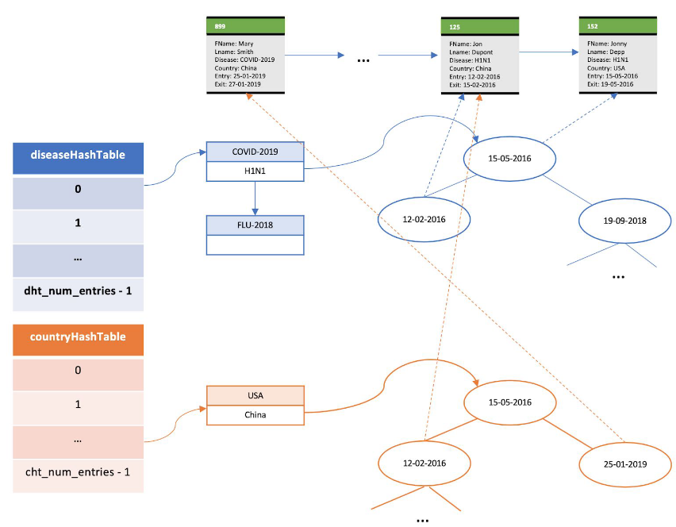

# diseaseMonitor

This program is implemented by a set of structures such as hash tables, binary trees and max heaps, in order to perform many viruses-related operations.

## Run
### ./diseaseMonitor -p patientRecordsFile –h1 diseaseHashtableNumOfEntries –h2 countryHashtableNumOfEntries –b bucketSize

+ diseaseHashtableNumOfEntries: the available space of a hash table used in order to locate a patient's information.
+ countryHashtableNumOfEntries: the available space of a hash table used in order to locate information about illnesses' cases per country.
+ patientRecordsFile: a ile that contains a series of patient records to be processed. Each line of this file describes a case of a virus, the patient's name, in which country, the date of admission to a hospital, and the date of discharge. For example if the contents of the file are:

              889 Mary Smith COVID-2019 China 25-1-2019 27-1-2019

              776 Larry Jones SARS-1 Italy 10-02-2003 –

              125 Jon Dupont  H1N1 USA 12-02-2016 15-02-2016

1. recordID: a string (it can only have digits) that determines, in a unique way, each record.
2. patientFirstName: a string consisting of letters, without any space.
3. patientLastName: a string consisting of letters, without any space.
4. diseaseID: a string consisting of letters, numbers and possibly a dash "-", but without spaces in-between.
5. country: a string consisting of letters, without any space.
6. entryDate: the date of admission to a hospital. Must have this kind of format DD-MM-YYYY.
7. exitDate: the date of discharge. The same format as the entryDate, but must be a later date than the entryDate.

The program starts by reading line by line the input file and initializes and saves to the memory the data structures it will use when executing the queries. Futhermore, a validation check of the input is being made.
When the application finishes processing the patientRecordsFile, it waits for user's input from the keyboard. The user is to give the following commands:
+ /globalDiseaseStats  [date1 date2]

The application prints the number of cases for each virus, that have been recorded in the system the given dates. If no dates are given, then it prints all the records for that specific virus.
+ /diseaseFrequency virusName [country] date1 date2

If no country argument is given, the application will print for the disease the number of cases recorded in the system within the dates [date1 ... date2]. If country argument is given, then it prints the results for the specific country.

+ /insertPatientRecord recordID patientFirstName patientLastName diseaseIDcountry entryDate [exitDate]

The application will import a new record with its components. The exitDate component is optional.

+ /recordPatientExit recordID exitDate

The application will add exitDate to the record with ID recordID.
+ /numCurrentPatients [disease]

If given the disease argument, the application will print the number of patients still being treated for that disease. If no argument of disease is given, the application will print for each virus the records of patients that are still being treated.
+ /exit

Exits the application. Releases all the memory.

## An example of the Data Structure use:

